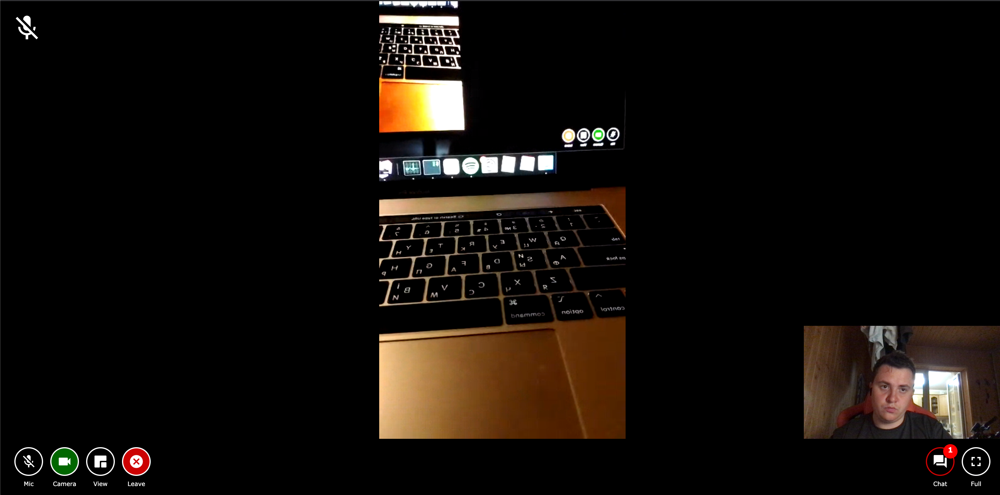

# Virtual Y 1on1 Meeting

This module provides base implementation of Virtual Y 1on1 Meetings.

Short video demo: https://www.loom.com/share/c49ef7bb4b2a4435ac78bfc53582e2f1

## Module structure

This module consists of the 1on1 Meeting entity, additional logic that works with it, and additional modules for the Virtual Y application. 

1on1 Meeting entity is a connection between the Virtual Y User, Trainer, and time for virtual meeting. Every meeting that is associated with client and trainer is shown on their Virtual Y calendar in the app.

You cannot use this module without SSL at your website, since it is a webRTC requirement.

### PersonalTraining entity

| Field name | Field machine name | Field type | Description |
| ---------- | ----------- | ----------- | ----------- |
| Customer   | customer_id | entity reference | The drupal user ID of client of the 1on1 Meeting entity. |
| Instructor | instructor_id | entity reference | The drupal user ID of instructor of the 1on1 Meeting entity. |
| Customer metadata | customer_metadata | text_long | The metadata for the customer from CRM systems (It could be user id, email, or something else). |
| Instructor metadata | instructor_metadata | text_long | The metadata for the instructor from CRM systems (It could be user id, email, or something else). |
| Training type | training_type | list_string | One to one call on the Virtual YMCA platform or link to remote platform (zoom, google meet, etc). Available options: `1-1` and `link` |
| Remote Link | remote_link | link | The link to remote platform (zoom, google meet, etc). Used when Training type is `link`. |
| Training Date | date | daterange | Training start and end time. Stores the date in an ISO format `YYYY-MM-DDTHH:MM:SS` in `value` and `end_value` fields.|
| Created | created | created | The time that the Training was created.|
| Changed | changed | changed | The time that the Training was last edited. |

### PersonalTrainingProvider plugin

This module implements `PersonalTrainingProvider` annotation. You can find example
of plugin implementation in `src/Plugin/PersonalTrainingProvider`. Plugin should
contain annotation with `id`, `label` and `config` and implements
`PersonalTrainingProviderInterface` with `checkPersonalTrainingAccess` and
`getUserPersonalTrainings` methods.

## 3rd Party System Data

To save data from third-party systems to PTF you should create a custom module with
`PersonalTrainingProvider` plugin instance and implement sync tool for data fetch.

## 1on1 Virtual Meetings server configuration.

1on1 Virtual Meetings has two modes: native and remote link. 

Using `remote link` mode, you can past a remote link to your Zoom, Meet, Teams, etc meetings. Use it if you have a working solution already.

Native mode gives you the ability to organize 1-1 calls inside your Virtual Y app, using WebRTC technology.

If you want to enable 1on1 Virtual Meetings module, you have to setup 3 additional services at your server or somewhere in the internet:

- `Signaling server` - Needed for first meet of your clients and trainer app each other. Virtual Y has team developed own Noode.js server solution for Simple-Peer library. You can find source code for it here: https://github.com/open-y-subprojects/virtual_y_signaling_server. Clone this repository and install server according to Readme file inside.
- `STUN server` - Google runs STUN servers as a free service, but with no SLA. They come preconfigured and should be reliable enough to use for most Virtual Y sites.
-  `TURN server` - This server is required to communicate between two WebRTC clients located in the different parts of the town/country/continent. It helps clients to find each other ips and send packages. Please use this manual to setup your own TURN server: https://nextcloud-talk.readthedocs.io/en/latest/TURN/. Please, do not use public servers, since they are not reliable. Use only your own for your production.

## Debug

1on1 Virtual Meetings has debugger that shows all connection information that could help in troubleshooting. 

Just set Debug (at this form: `admin/virtual-y/personal_training/settings`) to any number more than 0 and check your browser console.
